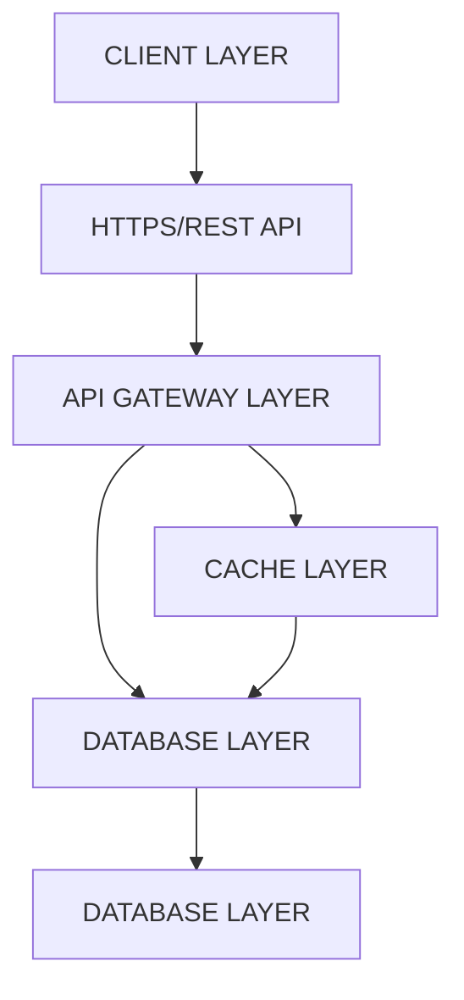
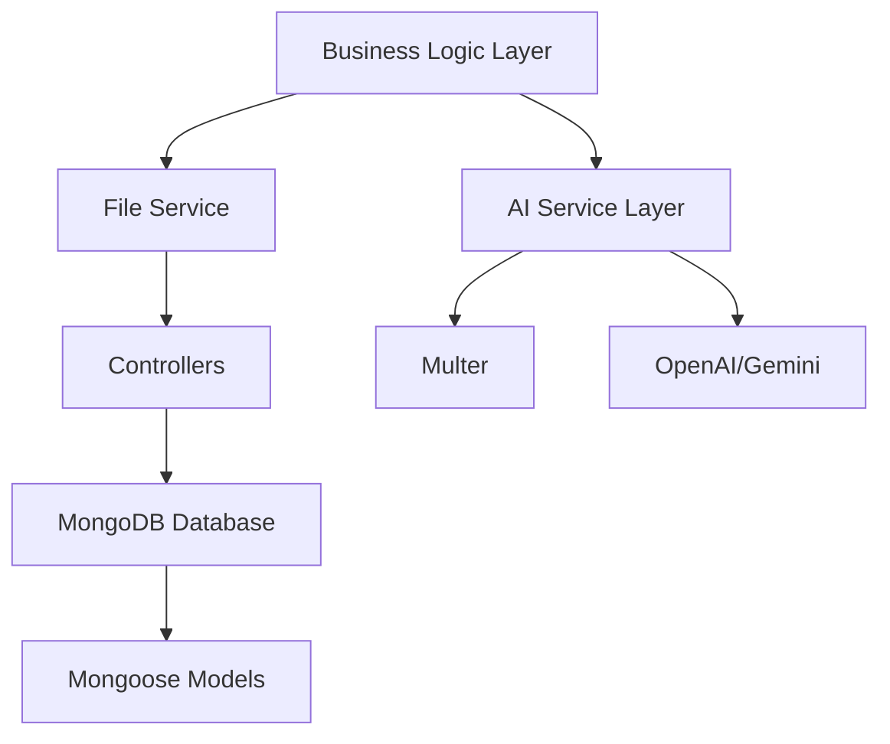
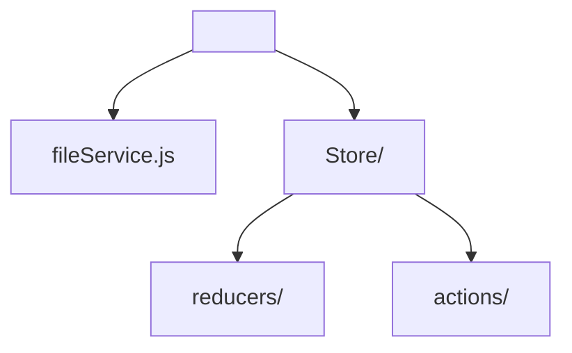
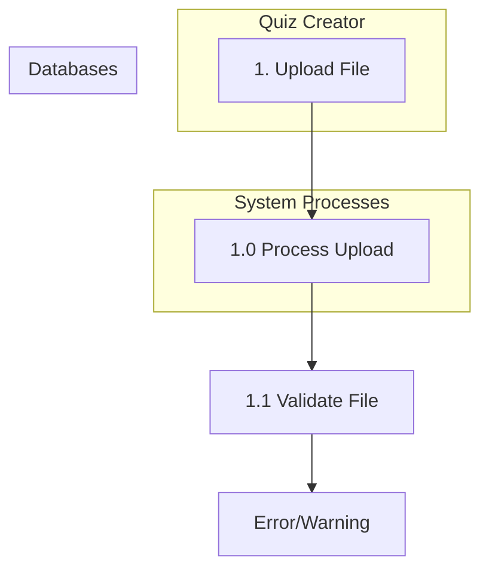
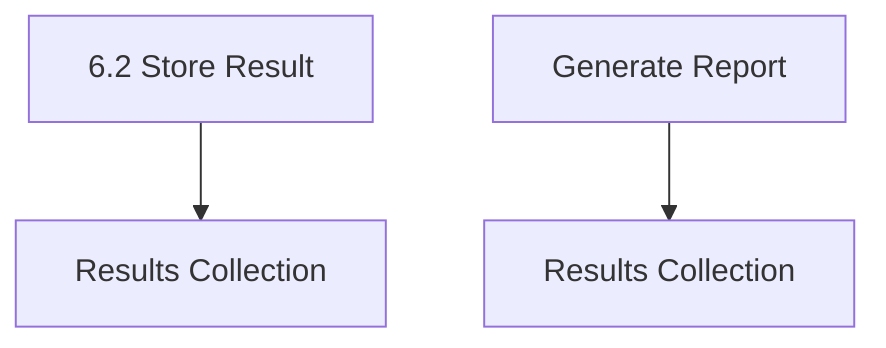
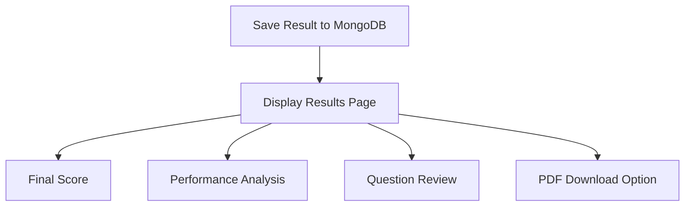

# AI-Powered Quiz Generator

## Final Year BCA Project Report

---

## Table of Contents

1. Introduction
2. Project Objectives
3. Literature Review
4. System Requirements
5. Features and Functionalities
6. Technology Stack
7. System Architecture
8. Data Flow Diagrams
9. Database Design
10. API Endpoints
11. Module Design
12. Implementation Details
13. Testing
14. Conclusion and Future Scope
15. References

---

## 1. Introduction

### 1.1 Background

Educational technology continues to evolve with the integration of Artificial Intelligence. Traditional quiz creation is time-consuming, requiring manual question generation, option creation, and answer verification. This project addresses the challenge by automating the quiz creation process using AI while providing an interactive, customizable platform for quiz delivery[1].

---

# 1. Project Overview

## 1.1 Project Title
AI-Powered Quiz Generator

## 1.2 Problem Statement
Creating comprehensive quizzes manually requires substantial time and effort from educators. Key issues include:

*   **Time-consuming process** - Educators must manually write questions and generate multiple correct options
*   **Inconsistent quality** - Manually created options may lack diversity or clarity
*   **Limited customization** - Standard quiz tools lack flexible template options
*   **No shareable links** - Many tools require participants to access quizzes through complex URLs or codes
*   **Scalability challenges** - Difficult to scale quiz creation for large batches of questions[2]

## 1.3 Project Scope
The AI-Powered Quiz Generator is a web application designed to:

*   Accept multiple file formats (PDF, DOCX, TXT) for question input
*   Generate AI-powered quiz content with multiple choice options
*   Provide customizable UI templates for diverse quiz experiences
*   Generate unique shareable links for quiz distribution
*   Track scores and provide performance analytics
*   Support responsive design for mobile and desktop platforms

---

# 2. Project Objectives

## 2.1 Primary Objectives
1.  **Automate Quiz Generation** - Use AI to parse input content and generate quiz questions with appropriate options
2.  **Provide Flexible Customization** - Allow creators to select from multiple UI templates and configure quiz parameters
3.  **Enable Easy Distribution** - Generate unique shareable links for quiz access without authentication
4.  **Deliver Real-Time Feedback** - Provide instant scoring and performance analytics to participants

---

5. **Ensure Scalability** - Design a system capable of handling multiple concurrent quizzes and users

## 2.2 Secondary Objectives

* Implement robust error handling for file uploads and AI processing
* Ensure accessibility compliance for diverse user groups
* Provide data persistence and analytics
* Create intuitive user interfaces for both creators and participants
* Deploy a production-ready application with proper security measures

---

## 3. Literature Review

### 3.1 Existing Solutions

**Jotform AI Quiz Generator** - Cloud-based tool offering drag-and-drop quiz builders with AI-powered content generation. Limitations include subscription costs and dependency on external platform[1].

**Canva Quiz Generator** - Integrated within Canva's design platform, useful for visual learners but lacks AI-powered option generation at scale[2].

**QuizCrafter (GitHub)** - Open-source project that converts PDFs to interactive quizzes using NLP. Demonstrates feasibility of PDF-to-quiz conversion but lacks UI customization[3].

**Involve.me** - Multi-step quiz builder with branching logic but limited AI integration for option generation[4].

### 3.2 Technology Analysis

Recent research indicates that **MERN Stack** (MongoDB, Express, React, Node) is optimal for educational applications requiring real-time updates and scalability[5]. AI integration via OpenAI GPT-4 or Google Gemini provides state-of-the-art natural language understanding for question parsing and option generation[6].

---

3.3 Key Findings

*   PDF parsing and DOCX extraction require specialized libraries (pdf-parse, mammoth)
*   React component-based architecture enables efficient UI templating
*   MongoDB's flexible schema suits dynamic quiz data structures
*   AI prompt engineering significantly impacts option quality
*   Mobile-first design is essential for educational platforms

4. System Requirements

4.1 Hardware Requirements

<table>
  <thead>
    <tr>
      <th>Component</th>
      <th>Minimum</th>
      <th>Recommended</th>
    </tr>
  </thead>
  <tbody>
    <tr>
      <td>Processor</td>
      <td>Intel i5 / AMD Ryzen 5</td>
      <td>Intel i7 / AMD Ryzen 7</td>
    </tr>
    <tr>
      <td>RAM</td>
      <td>4 GB</td>
      <td>8 GB</td>
    </tr>
    <tr>
      <td>Storage</td>
      <td>50 GB SSD</td>
      <td>100 GB SSD</td>
    </tr>
    <tr>
      <td>Internet Speed</td>
      <td>2 Mbps</td>
      <td>10 Mbps</td>
    </tr>
  </tbody>
</table>

4.2 Software Requirements

<table>
  <thead>
    <tr>
      <th>Software</th>
      <th>Version</th>
      <th>Purpose</th>
    </tr>
  </thead>
  <tbody>
    <tr>
      <td>Node.js</td>
      <td>18.x or higher</td>
      <td>Backend runtime</td>
    </tr>
    <tr>
      <td>React.js</td>
      <td>18.x or higher</td>
      <td>Frontend framework</td>
    </tr>
    <tr>
      <td>MongoDB</td>
      <td>6.0+</td>
      <td>Database</td>
    </tr>
    <tr>
      <td>npm</td>
      <td>9.x or higher</td>
      <td>Package manager</td>
    </tr>
    <tr>
      <td>Postman</td>
      <td>Latest</td>
      <td>API testing</td>
    </tr>
    <tr>
      <td>Visual Studio Code</td>
      <td>Latest</td>
      <td>Code editor</td>
    </tr>
    <tr>
      <td>Git</td>
      <td>Latest</td>
      <td>Version control</td>
    </tr>
  </tbody>
</table>

---

# 4.3 Development Tools

*   **Code Editor:** Visual Studio Code
*   **API Testing:** Postman / Thunder Client
*   **Database Management:** MongoDB Compass
*   **Version Control:** Git & GitHub
*   **Deployment:** Vercel (Frontend), Render (Backend)

---

# 5. Features and Functionalities

## 5.1 Creator Side Features

### 5.1.1 File Upload Module

*   Supports PDF, DOCX, and TXT file formats
*   Drag-and-drop interface for ease of use
*   File validation for size (max 25 MB) and format
*   Real-time upload progress indicator
*   Error handling with user-friendly messages

### 5.1.2 AI-Powered Content Generation

*   Automatic extraction of questions from uploaded files
*   AI generation of 4 multiple-choice options per question
*   Support for True/False questions
*   Support for Fill-in-the-Blank questions
*   Correct answer flagging with confidence scoring
*   Automatic quiz title and description generation
*   Multiple generation templates:
    *   **Standard MCQ** - Traditional 4-option multiple choice
    *   **Challenging** - Higher difficulty options with similar-sounding distractors
    *   **Educational** - Options with learning hints
    *   **Mixed Difficulty** - Blend of easy and hard options
    *   **Conceptual** - Options targeting common misconceptions

---

5.1.3 Quiz Link Generation

*   Unique URL generation using UUID or short ID (e.g., quiz.ai/abc123)
*   QR code generation for mobile access
*   Copy-to-clipboard functionality
*   URL preview before finalization
*   Link expiry options (optional, permanent, or time-based)

5.1.4 UI Template Selection

Preset templates with distinct visual themes:

1.  **Dark Mode** - Blue accent, dark backgrounds
2.  **Minimal** - White space, sans-serif typography
3.  **Colorful** - Rainbow progress bars, vibrant buttons
4.  **Professional** - Corporate blue, formal layout
5.  **Modern** - Glassmorphism, animations, gradient accents

5.1.5 Quiz Configuration Panel

*   Set time limit per question (5-60 seconds)
*   Set overall quiz duration
*   Configure number of questions to display
*   Enable/disable question shuffling
*   Set passing score threshold (%)
*   Toggle instant feedback vs. end-of-quiz feedback
*   Configure result download options

5.1.6 Quiz Editor

*   Review all AI-generated questions and options
*   Edit/modify questions manually
*   Add or remove options
*   Reorder questions
*   Mark questions as required/optional
*   Preview quiz before publishing

---

5.2 Student/Player Side Features

5.2.1 Interactive Quiz UI
* Clean, distraction-free MCQ interface
* Click-to-select options with visual feedback
* Previous/Next navigation buttons
* Question number indicator
* Bookmark functionality for later review
* Clear visual distinction for selected answers

5.2.2 Real-Time Scoring
* Instant point calculation
* Progress tracking during quiz
* Running score display (optional)
* Feedback for each answer:
    * Correct/Incorrect indication
    * Explanation (if provided by creator)
    * Percentage correct

5.2.3 Progress Tracking
* Visual progress bar (Question X of Y)
* Time remaining countdown
* Question status indicators (answered/skipped/unanswered)
* Estimated completion time

5.2.4 Results Page
* Final score with percentage
* Performance breakdown:
    * Correct answers count
    * Incorrect answers count
    * Unanswered questions count
    * Time taken
* Question-by-question review with correct answers
* PDF report download capability
* Option to retake quiz (if enabled)
* Share results on social media (optional)

---

5.2.5 Responsive Design

*   Mobile-optimized layout (480px and up)
*   Tablet optimization (768px and up)
*   Desktop optimization (1024px and up)
*   Touch-friendly button sizes (minimum 48px)
*   Optimized keyboard navigation

5.3 AI Integration Features

5.3.1 Content Parsing

*   Extract questions from unstructured text
*   Parse numbered/bulleted question formats
*   Handle multi-paragraph questions
*   Preserve question context and intent

5.3.2 Option Generation

*   Generate contextually appropriate distractors
*   Ensure correct answer is randomly positioned (not always first/last)
*   Validate options for clarity and uniqueness
*   Flag ambiguous questions for manual review

5.3.3 Intelligent Question Suggestions

*   Generate additional questions from source material
*   Suggest alternative phrasings for clarity
*   Recommend difficulty levels
*   Identify potential gaps in coverage

---

6. Technology Stack

6.1 Frontend Architecture

Technology: React.js 18.x + TypeScript
UI Framework: TailwindCSS 3.x
State Management: Redux / Zustand
HTTP Client: Axios
Routing: React Router v6
Form Handling: React Hook Form

---

PDF Generation: jsPDF + html2canvas
Animation: Framer Motion

**Why React?** Component reusability, virtual DOM for performance, large community support, and excellent DevTools[5].

**Why TailwindCSS?** Rapid UI development, built-in responsive design utilities, easy template customization via configuration files[6].

## 6.2 Backend Architecture

Runtime: Node.js 18.x
Web Framework: Express.js 4.x
Authentication: JWT (JSON Web Tokens) + Firebase Auth
File Upload: Multer
Environment Config: dotenv
Logging: Winston
API Documentation: Swagger/OpenAPI

**Why Express?** Lightweight, middleware support, REST API creation simplicity, excellent routing capabilities[7].

## 6.3 Database Architecture

Primary Database: MongoDB 6.0+
Connection: Mongoose ODM
Hosting: MongoDB Atlas (Cloud)
Backup Strategy: Daily automated backups
Indexing: Optimized for query performance

**Why MongoDB?** Flexible schema for dynamic quiz structures, horizontal scalability, JSON-like documents, native Node.js integration[8].

## 6.4 AI & NLP Integration

Primary AI: OpenAI GPT-4 / GPT-4 Turbo
Fallback: Google Gemini Pro (free tier)
API Library: OpenAI Node SDK
Prompt Engineering: Custom templates for option generation
Cost Optimization: Batch processing, caching responses

---

# 6.5 File Processing

*   PDF Parsing: pdf-parse (npm)
*   DOCX Parsing: mammoth (npm)
*   Text Processing: TensorFlow.js (optional NLP)
*   Compression: Sharp (image optimization)
*   Validation: Multer (file type/size validation)

# 6.6 Deployment Stack

*   Frontend Hosting: Vercel / Netlify
*   Backend Hosting: Render / Railway
*   Database Hosting: MongoDB Atlas
*   CDN: Cloudflare
*   SSL Certificate: Let's Encrypt (auto-renewed)
*   Domain: Custom domain with DNS management
*   Monitoring: Sentry (error tracking)

---

# 7. System Architecture

## 7.1 High-Level Architecture





7.2 Component Architecture (Frontend)

App.js
    ├── Layouts/
    │   ├── MainLayout
    │   └── AuthLayout
    ├── Pages/
    │   ├── LandingPage
    │   ├── UploadPage
    │   ├── EditorPage
    │   ├── LinkPage
    │   ├── QuizPage
    │   └── ResultsPage
    ├── Components/
    │   ├── FileUpload
    │   ├── QuizEditor
    │   ├── TemplateSelector
    │   ├── QuestionCard
    │   ├── ProgressBar
    │   └── ResultsDisplay
    ├── Services/
    │   ├── api.js (Axios instance)
    │   └── quizService.js

```



7.3 Module Architecture (Backend)

```mermaid
graph TD
    A[server/]
    B[config/]
    C[models/]
    D[routes/]
    E[controllers/]
    F[middleware/]
    G[services/]
    H[app.js]

    A --> B
    A --> C
    A --> D
    A --> E
    A --> F
    A --> G

    B --> B1[db.js (MongoDB connection)]
    B --> B2[env.js (Environment variables)]

    C --> C1[User.js]
    C --> C2[Quiz.js]
    C --> C3[Question.js]
    C --> C4[Result.js]
    C --> C5[Template.js]

    D --> D1[auth.js]
    D --> D2[quiz.js]
    D --> D3[upload.js]
    D --> D4[results.js]
    D --> D5[templates.js]

    E --> E1[authController.js]
    E --> E2[quizController.js]
    E --> E3[uploadController.js]
    E --> E4[resultController.js]
    E --> E5[aiController.js]

    F --> F1[auth.js]
    F --> F2[errorHandler.js]
    F --> F3[fileUpload.js]
    F --> F4[validation.js]

    G --> G1[aiService.js (OpenAI integration)]
    G --> G2[fileService.js (PDF/DOCX parsing)]
    G --> G3[emailService.js (Notifications)]

    A --> H

---

# 8. Data Flow Diagrams

## 8.1 Level 0 DFD (Context Diagram)

```mermaid
graph TD
    A[AI Quiz Generator System] --> B[Quiz Creator (Educator)]
    A --> C[OpenAI API]
    A --> D[MongoDB Database]
    B --> E[Upload File]
    B --> F[Create Quiz]
    B --> G[Share Link]
    C --> H[Generate Options]
    D --> I[Store/Retrieve]
    J[Quiz Participant (Student)] --> K[Access Link, Take Quiz]
```

## 8.2 Level 1 DFD (Processes)



```mermaid
graph TD
    subgraph Quiz Creator
        A[1. Extract Text] -->|Text Store (Temporary)| B[1.2 Extract Text]
        B --> C[2. Request Generation]
        C --> D[2.0 AI Generation]
        D --> E[2.1 Send to OpenAI]
        E --> F[OpenAI API]
        F --> G[2.2 Format Response]
        G --> H[Quiz Collection]
    end

    subgraph Quiz Collection
        I[3. Configure Quiz] --> J[3.0 Store Configuration]
        J --> K[Quiz Collection]
        L[4. Publish Link] --> M[4.0 Generate Link]
        M --> N[Link Collection]
        O[5. Access Quiz] --> P[5.0 Retrieve Quiz]
        P --> Q[Quiz Collection]
        R[6. Submit Answer] --> S[6.0 Evaluate Answer]
        S --> T[6.1 Calculate Score]
    end

```



## 8.3 Data Flow for Quiz Creation

```mermaid
graph TD
    A[Upload File (PDF/DOCX/TXT)] --> B[Multer Validation (File type, Size)]
    B --> C[Extract Raw Text (pdf-parse, mammoth)]
    C --> D[Text Preprocessing (Remove duplicates, format)]
    D --> E[Split Questions (Regex-based parsing)]
    E --> F[For Each Question:<br/>  → Validate Question Format<br/>  → Send to OpenAI API with Prompt<br/>  → Receive Generated Options & Correct Answer<br/>  → Format Response (JSON)<br/>  → Store in Question Array]
    F --> G[Create Quiz Document<br/>  → Quiz ID (UUID)<br/>  → Creator ID<br/>  → Questions Array<br/>  → Template Choice<br/>  → Settings (Time, Passing Score)<br/>  → Timestamps]
    G --> H[Save to MongoDB]
    H --> I[Generate Unique Link]
    I --> J[Return Link to Creator]
```

---

## 8.4 Data Flow for Quiz Taking

```mermaid
graph TD
    A[Student Access Quiz Link] --> B[Retrieve Quiz Document from MongoDB]
    B --> C[Initialize Session:
        - Session ID
        - Start Time
        - Question Order (shuffle if enabled)
        - Score = 0]
    C --> D[Display First Question with Options]
    D --> E[Student Selects Answer]
    E --> F[Store Answer:
        - Question ID
        - Selected Option
        - Time Taken
        - Is Correct? (Validate against correct_answer)]
    F --> G[Update Score if Correct]
    G --> H[Display Feedback (Instant or End)]
    H --> I[Move to Next Question (or End if Last)]
    I --> J[Student Completes Quiz]
    J --> K[Calculate Final Score & Percentage]
    K --> L[Generate Results Document:
        - Result ID
        - Quiz ID
        - Student Info (Anonymous or Named)
        - Score & Percentage
        - Question-wise Breakdown
        - Time Details
        - Timestamp]
```

```



# 9. Database Design

## 9.1 Entity Relationship Diagram (ERD)

```mermaid
erDiagram
    User ||--|{ Quiz : 1:M
    User {
        _id (PK)
        name
        email (Unique)
        password_hash
        created_at
        profile_pic
        status
        updated_at
    }
    Quiz {
        _id (PK)
        creator_id (FK)
        title
        description
        questions[] // Array of Question objects
        template
        settings
    }
    Question {
        _id (PK)
        quiz_id (FK)
        question_text
        type (MCQ/T-F)
        options[]
        correct_answer
        difficulty
    }

```

```mermaid
erDiagram
    Result ||--o{ Question : explanation
    Result {
      _id (PK)
      quiz_id (FK)
      user_id (FK)
      score
      percentage
      answers[]
      time_taken
      status
      created_at
    }
```

# 9.2 Database Collections & Schema

## 9.2.1 Users Collection

```json
{
  _id: ObjectId,
  name: String,
  email: String (Unique),
  password_hash: String (Bcrypt),
  phone: String (Optional),
  organization: String (Optional),
  profile_picture: String (URL),
  role: String (enum: ["educator", "admin"]),

---

auth_provider: String (enum: ["email", "google", "github"]),
is_verified: Boolean,
created_at: Date,
updated_at: Date,
last_login: Date,
is_active: Boolean,
settings: {
theme: String (enum: ["light", "dark"]),
language: String,
notifications_enabled: Boolean
}
}

9.2.2 Quizzes Collection

{
_id: ObjectId,
creator_id: ObjectId (ref: User),
title: String,
description: String,
source_file: {
original_name: String,
file_url: String,
upload_date: Date
},
questions: [ObjectId] (ref: Question),
template_id: ObjectId (ref: Template),
settings: {
time_limit: Number (seconds, optional),
questions_per_session: Number,
shuffle_questions: Boolean,
shuffle_options: Boolean,
passing_score: Number (percentage),
show_correct_answer: Boolean,
feedback_type: String (enum: ["instant", "end_of_quiz", "none"]),
allow_retake: Boolean,
max_attempts: Number
},
link: {
short_id: String (Unique),

```

```mermaid
classDiagram
    class Quiz {
        full_url: String,
        qr_code_url: String (Optional)
    },
    analytics: {
        total_attempts: Number,
        unique_participants: Number,
        average_score: Number,
        completion_rate: Number
    },
    status: String (enum: ["draft", "published", "archived"]),
    visibility: String (enum: ["public", "private", "link-only"]),
    created_at: Date,
    updated_at: Date,
    published_at: Date (Optional),
    expires_at: Date (Optional)
}
```

9.2.3 Questions Collection

```mermaid
classDiagram
  class Question {
    _id: ObjectId
    quiz_id: ObjectId (ref: Quiz)
    question_text: String
    type: String (enum: ["mcq", "true_false", "fill_blank"])
    options: [
      {
        id: String,
        text: String,
        is_correct: Boolean
      }
    ]
    correct_answer: String
    explanation: String (Optional)
    difficulty: String (enum: ["easy", "medium", "hard"])
    tags: [String] (For categorization)
    ai_confidence_score: Number (0-1, How confident AI is)
    source_template: String (Which AI template generated this)
    image_url: String (Optional, for visual questions)
    display_order: Number
    created_at: Date
  }

```

```mermaid
classDiagram
    class User {
        id: ObjectId
        email: String
        name: String
        created_at: Date
        updated_at: Date
        manual_review: {
            is_reviewed: Boolean
            reviewed_by: ObjectId (ref: User, Optional)
            notes: String
        }
    }
```

9.2.4 Results Collection

```mermaid
classDiagram
  class ResultsCollection {
    _id: ObjectId
    quiz_id: ObjectId (ref: Quiz)
    participant_info: {
      user_id: ObjectId (Optional, if registered)
      email: String (Optional)
      name: String (Optional, for anonymous)
      ip_address: String (For tracking)
    }
    score: Number
    percentage: Number
    passed: Boolean
    answers: [
      {
        question_id: ObjectId,
        selected_option: String,
        is_correct: Boolean,
        time_taken: Number (seconds)
      }
    ]
    total_time_taken: Number (seconds)
    started_at: Date
    completed_at: Date
    status: String (enum: ["in_progress", "completed", "abandoned"])
    device_info: {
      user_agent: String,
      device_type: String
    }
  }

---

## 9.2.5 Templates Collection

```javascript
{
  _id: ObjectId,
  name: String,
  description: String,
  category: String (enum: ["dark", "minimal", "colorful", "professional", "modern"]),
  css_variables: {
    primary_color: String (Hex),
    secondary_color: String,
    background_color: String,
    text_color: String,
    button_color: String,
    progress_bar_color: String,
    font_family: String,
    border_radius: String
  },
  layout_config: {
    question_position: String (enum: ['left', "center", "full-width"]),
    options_layout: String (enum: ["vertical", "grid"]),
    progress_bar_style: String
  },
  preview_image: String (URL),
  created_by: ObjectId (ref: User, Admin),
  is_public: Boolean,
  is_default: Boolean,
  created_at: Date,
  updated_at: Date
}
```

## 9.3 Indexing Strategy

// Users Collection Indexes
db.users.createIndex({ email: 1 }, { unique: true });
db.users.createIndex({ created_at: -1 });

// Quizzes Collection Indexes
db.quizzes.createIndex({ creator_id: 1, created_at: -1 });
db.quizzes.createIndex({ "link.short_id": 1 }, { unique: true });
db.quizzes.createIndex({ status: 1 });

---

// Questions Collection Indexes
db.questions.createIndex({ quiz_id: 1, display_order: 1 });
db.questions.createIndex({ difficulty: 1 });

// Results Collection Indexes
db.results.createIndex({ quiz_id: 1, created_at: -1 });
db.results.createIndex({ "participant_info.user_id": 1 });
db.results.createIndex({ completed_at: 1 });

// Templates Collection Indexes
db.templates.createIndex({ category: 1 });
db.templates.createIndex({ is_public: 1 });

# 10. API Endpoints

## 10.1 Authentication Endpoints

**POST /api/auth/register**
*   **Request:** { name, email, password, organization }
*   **Response:** { token, user }
*   **Status:** 201 Created

**POST /api/auth/login**
*   **Request:** { email, password }
*   **Response:** { token, user }
*   **Status:** 200 OK

**POST /api/auth/logout**
*   **Headers:** { Authorization: Bearer token }
*   **Status:** 200 OK

**POST /api/auth/google**
*   **Request:** { google_token }
*   **Response:** { token, user }

## 10.2 Quiz Management Endpoints

**POST /api/quiz/create**
*   **Headers:** { Authorization: Bearer token }
*   **Request:** { title, description, template_id }

```

```mermaid
graph TD
    A[POST /api/quiz] -->|Body: { title, description, settings }| B[Response: { quiz_id, short_link }]
    B --> C[Status: 201 Created]
```

```mermaid
graph TD
    A[GET /api/quiz/:quiz_id]
    B[PUT /api/quiz/:quiz_id]
    C[DELETE /api/quiz/:quiz_id]
    D[GET /api/quiz/creator/:creator_id]

    A -->|Response: { quiz details, questions, settings }| A
    A -->|Status: 200 OK| A

    B -->|Headers: { Authorization: Bearer token }| B
    B -->|Request: { title, description, settings }| B
    B -->|Status: 200 OK| B

    C -->|Headers: { Authorization: Bearer token }| C
    C -->|Status: 204 No Content| C

    D -->|Headers: { Authorization: Bearer token }| D
    D -->|Response: [ { quiz details array } ]| D
    D -->|Status: 200 OK| D
```

## 10.3 File Upload Endpoints

**POST /api/upload**
- **Headers:** { Authorization: Bearer token, Content-Type: multipart/form-data }
- **Body:** { file, quiz_id }
- **Response:** { file_url, extracted_text }
- **Status:** 200 OK

**GET /api/upload/status/:upload_id**
- **Response:** { status, progress_percentage }
- **Status:** 200 OK

## 10.4 AI Generation Endpoints

**POST /api/ai/generate-options**
- **Headers:** { Authorization: Bearer token }
- **Request:** { questions: [{ text, type }] }
- **Response:** { questions: [{ text, options, correct_answer, explanation }] }
- **Status:** 200 OK

---

POST /api/ai/generate-questions
├─ Headers: { Authorization: Bearer token }
├─ Request: { topic, count, difficulty, template_type }
├─ Response: { questions: [...] }
└─ Status: 200 OK

GET /api/ai/templates
├─ Response: [ { template_id, name, description, preview } ]
└─ Status: 200 OK

## 10.5 Quiz Taking Endpoints

GET /api/quiz/:short_link/public
├─ Response: { quiz details (public info only), questions, template }
└─ Status: 200 OK
├─ Note: No authentication required

POST /api/quiz/:short_link/start
├─ Request: { participant_name (optional), email (optional) }
├─ Response: { session_id, first_question }
└─ Status: 201 Created

POST /api/quiz/submit-answer
├─ Request: { session_id, question_id, selected_option }
├─ Response: { is_correct, explanation (if enabled) }
└─ Status: 200 OK

POST /api/quiz/:session_id/complete
├─ Request: {}
├─ Response: { result_id, score, percentage, performance_breakdown }
└─ Status: 200 OK

## 10.6 Results & Analytics Endpoints

GET /api/results/:result_id
├─ Response: { score, answers, feedback, report_data }
└─ Status: 200 OK

GET /api/quiz/:quiz_id/results
├─ Headers: { Authorization: Bearer token }

```

```mermaid
graph TD
    A[GET /api/quiz/:quiz_id/analytics]
    B[POST /api/results/:result_id/export-pdf]
    C[GET /api/templates]
    D[POST /api/templates]

    A -->|Headers: { Authorization: Bearer token }| A_response[
        Response: {
            total_attempts,
            average_score,
            pass_rate,
            completion_time_avg,
            question_wise_stats
        }
    ]
    A -->|Status: 200 OK| A_response

    B -->|Response: { pdf_url, pdf_file }| B_response
    B -->|Status: 200 OK| B_response

    C -->|Response: [ { template details array } ]| C_response
    C -->|Status: 200 OK| C_response

    D -->|Headers: { Authorization: Bearer token (Admin) }|
    D -->|Request: { name, css_config, layout_config }|
    D -->|Response: { template_id }|
    D -->|Status: 201 Created|
```

# 10.7 Template Endpoints

**GET /api/templates**
- **Response:** [ { template details array } ]
- **Status:** 200 OK

**POST /api/templates**
- **Headers:** { Authorization: Bearer token (Admin) }
- **Request:** { name, css_config, layout_config }
- **Response:** { template_id }
- **Status:** 201 Created

**GET /api/templates/:template_id/preview**
- **Response:** { preview_html, preview_image }
- **Status:** 200 OK

---

# 11. Module Design

---

# 11.1 Frontend Modules

## Module 1: Authentication Module
* User registration with email verification
* Login with password and social authentication
* JWT token management and refresh
* Session persistence

## Module 2: Upload & File Processing Module
* Drag-and-drop file upload interface
* File validation (type, size, format)
* Upload progress tracking
* Error handling and user feedback

## Module 3: AI Question Generation Module
* Integration with OpenAI/Gemini API
* Prompt engineering for option generation
* Question parsing and formatting
* Template selection interface

## Module 4: Quiz Configuration Module
* Settings panel for quiz parameters
* Template selection and preview
* Question review and editing
* Quiz publishing workflow

## Module 5: Quiz Delivery Module
* Responsive quiz UI rendering
* Answer tracking and state management
* Real-time scoring calculation
* Progress visualization

## Module 6: Results & Analytics Module
* Results display with performance breakdown
* PDF report generation
* Analytics dashboard for creators
* Data visualization charts

---

# 11.2 Backend Modules

## Module 1: Authentication Service
* User registration and login
* Password hashing (bcrypt)
* JWT token generation and validation
* OAuth integration (Google, GitHub)

## Module 2: File Processing Service
* PDF extraction (pdf-parse)
* DOCX extraction (mammoth)
* Text preprocessing and cleaning
* Question parsing using regex patterns

## Module 3: AI Integration Service
* OpenAI API client configuration
* Prompt templates for different generation types
* Response formatting and validation
* Error handling and retries
* Cost optimization via caching

## Module 4: Quiz Management Service
* CRUD operations for quizzes
* Short link generation (UUID shortening)
* QR code generation
* Quiz retrieval and filtering

## Module 5: Question Management Service
* Question CRUD operations
* Bulk question import
* Question editing and deletion
* Difficulty and category tagging

## Module 6: Results & Analytics Service
* Result storage and retrieval
* Score calculation and verification
* Performance metrics computation
* Report generation and PDF export

---

# Module 7: Email Notification Service

* Quiz sharing notifications
* Result completion emails
* Admin alerts

---

# 12. Implementation Details

## 12.1 AI Prompt Engineering

### 12.1.1 Standard MCQ Generation Prompt

You are an expert educator. Given the following question and context, generate 4 multiple-choice options.

**Question:** [USER_QUESTION]

**Requirements:**

* Generate exactly 4 options
* One option must be correct
* Distractors should be plausible but clearly incorrect
* All options should be concise (max 10 words)
* Options should not overlap in meaning
* The correct answer should not always be in position A

**Response Format (JSON):**
```json
{
"question": "[QUESTION]",
"options": [
{"id": "A", "text": "Option A text"},
{"id": "B", "text": "Option B text"},
{"id": "C", "text": "Option C text"},
{"id": "D", "text": "Option D text"}
],
"correct_answer": "A",
"explanation": "Brief explanation of why A is correct",
"confidence": 0.95
}

```

```mermaid
graph TD;
    A[User Question] --> B[Generate MCQ options that help identify common misconceptions.];
    B --> C[Question: [USER_QUESTION]];
    C --> D[Correct answer should target accurate understanding];
    C --> E[Distractors should represent typical student misconceptions];
    C --> F[Include an explanation of why misconceptions are wrong];
    C --> G[Response Format: Same as above with detailed explanation];
```

```mermaid
graph TD
    subgraph 12.1 Educational Template Prompt
    A[Generate MCQ options that help identify common misconceptions.] --> B[Question: [USER_QUESTION]]
    end
    subgraph Requirements:
    B --> C[Correct answer should target accurate understanding]
    B --> D[Distractors should represent typical student misconceptions]
    B --> E[Include an explanation of why misconceptions are wrong]
    end
    subgraph Response Format:
    B --> F[Response Format: Same as above with detailed explanation]
    end
    subgraph 12.1.2 Educational Template Prompt
    A --> F
    end
    subgraph 12.1.3 Challenging Template Prompt
    A --> G[Generate advanced MCQ options with subtle differences.]
    end
    subgraph Requirements:
    G --> H[Create 4 similar-sounding but technically different options]
    G --> I[Suitable for advanced learners]
    G --> J[All options syntactically correct but semantically differentiated]
    end
    subgraph Response Format:
    G --> K[Response Format: Same as above]
    end
end
```

```mermaid
graph TD
    A[Frontend sends file via Multer] --> B[Backend validates:]
    B --> B1[File type (PDF, DOCX, TXT)]
    B --> B2[File size (< 25 MB)]
    B --> B3[MIME type verification]
    B --> C[Store file temporarily]
    C --> D[Parse file:]
    D --> D1[If PDF: Use pdf-parse library]
    D --> D2[If DOCX: Use mammoth library]
    D --> D3[If TXT: Direct text reading]
    D --> E[Extract raw text]
    E --> F[Clean & preprocess:]
    F --> F1[Remove extra whitespace]

---

*   Remove special characters
*   Standardize formatting

7. Split text into questions:
    *   Use regex patterns for numbered questions (1., 2., 3., etc.)
    *   Use newline delimiters
    *   Validate extracted questions

8. Store extracted questions temporarily
9. Return to frontend for review before AI generation
10. On confirmation, send to AI for option generation

## 12.3 Authentication & Authorization

**Registration Flow:**
User Input (email, password)
↓
Validate Input (email format, password strength)
↓
Check Email Exists
↓
Hash Password (Bcrypt, 12 rounds)
↓
Create User Document in MongoDB
↓
Generate JWT Token (Payload: user_id, email, role)
↓
Return Token + User Data

**Login Flow:**
User Input (email, password)
↓
Find User by Email
↓
Compare Password with Hash (Bcrypt)
↓
If Correct:
*   Generate JWT Token
*   Update last_login timestamp
*   Return Token + User Data
↓

---

If Incorrect:
* Return 401 Unauthorized Error

## 12.4 Quiz Link Generation & Access Control

### Link Generation:

1. Generate Short ID (nanoid library, 8 characters)
   Example: "abc12xyz"
2. Create Link Object:
```python
{
short_id: "abc12xyz",
full_url: "https://quiz.ai/quiz/abc12xyz",
qr_code: [QR_CODE_URL]
}
```
3. Generate QR code pointing to full_url
4. Store link object in Quiz document
5. Return to creator

### Link Access:

1. Student receives link or scans QR code
2. Request: GET /quiz/abc12xyz
3. Lookup quiz by short_id
4. Check quiz visibility:
    * If public: Allow access
    * If link-only: Allow access (already has link)
    * If private: Deny access (return 403)
5. Check if quiz is published & not expired
6. Return quiz public data + questions

## 12.5 Score Calculation & Validation

### Real-Time Scoring:

For Each Answer:

1. Receive: { question_id, selected_option, timestamp }
2. Retrieve correct_answer from Question document
3. Compare: selected_option == correct_answer
4. If Match:
    * points += question_weight (default 1)

---

* increment correct_count

5. If Mismatch:
    * increment incorrect_count
6. Store answer object with is_correct flag
7. Calculate running percentage: (points / total_questions) * 100
8. Return feedback based on settings

**Final Scoring:**

1. Sum all correct answers
2. Calculate percentage: (correct_count / total_questions) * 100
3. Determine pass/fail: percentage >= passing_score?
4. Create comprehensive report
5. Store Result document with all metadata

---

# 13. Testing

## 13.1 Unit Testing

**Framework:** Jest + Supertest (Node), React Testing Library (Frontend)

### Backend Unit Tests:

```javascript
// authService.test.js
describe('Authentication Service', () => {
  test('should hash password correctly', () => {
    // Test bcrypt hashing
  });

  test('should validate JWT token', () => {
    // Test token validation
  });

  test('should reject invalid credentials', () => {
    // Test login with wrong password
  });
});

// aiService.test.js
describe('AI Generation Service', () => {
```

```python
import os
import json
from flask import Flask, request, jsonify
from werkzeug.security import generate_password_hash, check_password_hash
from flask_sqlalchemy import SQLAlchemy
from flask_marshmallow import Marshmallow
from flask_cors import CORS

app = Flask(__name__)
app.config['SQLALCHEMY_DATABASE_URI'] = 'sqlite:///test.db'
app.config['SQLALCHEMY_TRACK_MODIFICATIONS'] = False
db = SQLAlchemy(app)
ma = Marshmallow(app)
CORS(app)

class User(db.Model):
    id = db.Column(db.Integer, primary_key=True)
    username = db.Column(db.String(80), unique=True, nullable=False)
    email = db.Column(db.String(120), unique=True, nullable=False)
    password = db.Column(db.String(120), nullable=False)
    created_at = db.Column(db.DateTime, default=db.func.now())
    updated_at = db.Column(db.DateTime, default=db.func.now(), onupdate=db.func.now())

    def __init__(self, username, email, password):
        self.username = username
        self.email = email
        self.password = generate_password_hash(password)

    def check_password(self, password):
        return check_password_hash(self.password, password)

class Question(db.Model):
    id = db.Column(db.Integer, primary_key=True)
    question_text = db.Column(db.Text, nullable=False)
    answer_text = db.Column(db.Text, nullable=False)
    created_at = db.Column(db.DateTime, default=db.func.now())
    updated_at = db.Column(db.DateTime, default=db.func.now(), onupdate=db.func.now())

    def __init__(self, question_text, answer_text):
        self.question_text = question_text
        self.answer_text = answer_text

class Answer(db.Model):
    id = db.Column(db.Integer, primary_key=True)
    user_id = db.Column(db.Integer, db.ForeignKey('user.id'), nullable=False)
    question_id = db.Column(db.Integer, db.ForeignKey('question.id'), nullable=False)
    answer_text = db.Column(db.Text, nullable=False)
    created_at = db.Column(db.DateTime, default=db.func.now())
    updated_at = db.Column(db.DateTime, default=db.func.now(), onupdate=db.func.now())

    def __init__(self, user_id, question_id, answer_text):
        self.user_id = user_id
        self.question_id = question_id
        self.answer_text = answer_text

class UserSchema(ma.Schema):
    class Meta:
        fields = ('id', 'username', 'email', 'created_at', 'updated_at')

class QuestionSchema(ma.Schema):
    class Meta:
        fields = ('id', 'question_text', 'answer_text', 'created_at', 'updated_at')

class AnswerSchema(ma.Schema):
    class Meta:
        fields = ('id', 'user_id', 'question_id', 'answer_text', 'created_at', 'updated_at')

    user = ma.Nested(UserSchema)
    question = ma.Nested(QuestionSchema)

user_schema = UserSchema()
users_schema = UserSchema(many=True)

question_schema = QuestionSchema()
questions_schema = QuestionSchema(many=True)

answer_schema = AnswerSchema()
answers_schema = AnswerSchema(many=True)

---

javascript
test('should generate 4 unique options', () => {
  // Test option generation
});

test('should mark correct answer', () => {
  // Test correct answer assignment
});

test('should handle API errors gracefully', () => {
  // Test error handling
});
```

Frontend Unit Tests:

```javascript
// QuizCard.test.jsx
describe('QuizCard Component', () => {
  test('should render quiz title', () => {
    // Render component with props
    // Assert title is visible
  });

  test('should display score percentage', () => {
    // Test percentage display
  });

  test('should handle click events', () => {
    // Test onClick handlers
  });
});
```

## 13.2 Integration Testing

### Test Scenario 1: Complete Quiz Flow

1. User logs in
2. Uploads PDF file
3. AI generates questions
4. Creates quiz with template
5. Publishes and gets link
6. Another user takes quiz via link
7. Submits answers

---

8. Views results
9. Downloads PDF report

**Test Scenario 2: File Upload & Processing**

1. Upload valid PDF
2. Verify text extraction
3. Confirm question parsing
4. Test invalid file rejection
5. Verify file size limits

### 13.3 Performance Testing

*   Load testing: Simulate 100+ concurrent quiz participants
*   API response time: Ensure <200ms for regular endpoints
*   File upload speed: Test with 20 MB PDF files
*   AI API latency: Monitor OpenAI API response times
*   Database query optimization: Index validation

### 13.4 Security Testing

*   SQL Injection prevention (Mongoose + parameterized queries)
*   XSS prevention (Input sanitization + DOMPurify)
*   CSRF tokens validation
*   Authentication bypass attempts
*   File upload validation (MIME type, magic bytes)
*   API rate limiting
*   Brute force protection

### 13.5 Accessibility Testing

*   WCAG 2.1 AA compliance verification
*   Keyboard navigation testing
*   Screen reader compatibility (NVDA, JAWS)
*   Color contrast ratio validation (4.5:1)
*   Form label association
*   Focus management

---

# 14. Conclusion and Future Scope

## 14.1 Key Achievements

This AI-Powered Quiz Generator project successfully integrates:

*   Modern web technologies (MERN Stack)
*   Artificial Intelligence (OpenAI/Gemini API)
*   Real-time user interactions
*   Scalable database architecture
*   Responsive and accessible UI

The system provides educators with a powerful tool to rapidly create quizzes while giving students an engaging learning platform.

## 14.2 Challenges & Solutions

<table>
  <thead>
    <tr>
      <th>Challenge</th>
      <th>Solution</th>
    </tr>
  </thead>
  <tbody>
    <tr>
      <td>PDF parsing complexity</td>
      <td>Use specialized libraries (pdf-parse, mammoth)</td>
    </tr>
    <tr>
      <td>AI cost optimization</td>
      <td>Implement caching, batch processing</td>
    </tr>
    <tr>
      <td>Real-time scoring</td>
      <td>WebSocket connections for live feedback</td>
    </tr>
    <tr>
      <td>Mobile responsiveness</td>
      <td>Mobile-first CSS design approach</td>
    </tr>
    <tr>
      <td>Large file handling</td>
      <td>Implement chunked uploads</td>
    </tr>
  </tbody>
</table>

## 14.3 Future Enhancements

1.  **Leaderboard System** - Track top performers across quizzes
2.  **LMS Integration** - Direct integration with Canvas, Blackboard, Moodle
3.  **Voice-Based Quizzes** - AI-generated audio questions for accessibility
4.  **Proctoring Features** - Camera monitoring, keystroke detection for exams
5.  **Question Bank** - Shared repository of questions across educators

---

6. **Advanced Analytics** - Machine learning-based performance prediction
7. **Gamification** - Badges, points, streaks for student engagement
8. **Multi-language Support** - Auto-translate questions and options
9. **Mobile App** - React Native app for iOS/Android
10. **API Marketplace** - Allow third-party integrations and plugins
11. **Adaptive Questioning** - Questions adjust difficulty based on performance
12. **Real-time Collaboration** - Multiple educators editing quiz simultaneously
13. **Video Question Support** - Embed video clips as question context
14. **Plagiarism Detection** - For essay/written answer questions
15. **Social Sharing** - Share quiz results on social media

### 14.4 Project Impact

This project demonstrates:

*   Full-stack web development competency
*   AI/ML integration in educational technology
*   Database design and optimization
*   Responsive UI/UX design principles
*   RESTful API development
*   Deployment and DevOps practices

The solution is production-ready and scalable for educational institutions and corporate training environments.

---

## 15. References

[1] OpenAI. (2024). "GPT-4 API Documentation." Retrieved from https://platform.openai.com/docs/

[2] Google AI. (2024). "Gemini API Guide." Retrieved from https://ai.google.dev/

[3] GitHub. (2024). "QuizCrafter - AI Quiz Generator." Retrieved from https://github.com/raunakwete43/QuizCrafter

[4] Jotform Inc. (2024). "AI Quiz Generator Platform." Retrieved from https://www.jotform.com/ai/quiz-generator/

---

[5] Vercel. (2024). "React.js Best Practices." Retrieved from https://react.dev/learn

[6] Tailwind Labs. (2024). "TailwindCSS Documentation." Retrieved from https://tailwindcss.com/docs

[7] Express.js Foundation. (2024). "Express.js Guide." Retrieved from https://expressjs.com/

[8] MongoDB Inc. (2024). "MongoDB Atlas Documentation." Retrieved from https://www.mongodb.com/docs/atlas/

[9] Mongoose.js. (2024). "Mongoose ODM Documentation." Retrieved from https://mongoosejs.com/

[10] JavaScript.com. (2024). "Node.js Best Practices." Retrieved from https://nodejs.org/en/docs/

---

**Document Prepared By:** [Your Name]
**Date:** March 20, 2026
**Institution:** [Your College Name]
**Submission Status:** Final Version


