# AI-Powered Quiz Generator

## Frontend Module Documentation

| Field | Details |
| --- | --- |
| Prepared By | Shezan Fayaz |
| Institution | Islamia College of Science and Commerce |
| Project | AI-Powered Quiz Generator - BCA Final Year |
| Document | Frontend Modules, Pages & Components |
| Date | March 2026 |
| Version | 1.0 |

<table>
  <tr>
    <td>
      <h3>8</h3>
      
Pages

    </td>
    <td>
      <h3>35</h3>
      
Components

    </td>
    <td>
      <h3>3</h3>
      
Layouts

    </td>
    <td>
      <h3>7</h3>
      
Services/Hooks

    </td>
  </tr>
</table>

---

# 1. Module Division

The frontend is divided into 6 functional modules, split across two user flows. The creator flow (modules 1-4) handles quiz creation, editing, configuration, and publishing. The student flow (modules 5-6) handles quiz delivery and results display. Routing and state management wires all modules together.

## 1.1 Three-person team split

Based on a 3-person team with one experienced developer, the work is split by layer:

<table>
  <thead>
    <tr>
      <th>Person</th>
      <th>Layer / Responsibility</th>
    </tr>
  </thead>
  <tbody>
    <tr>
      <td>Person 1 (intermediate)</td>
      <td>Frontend - all 6 modules, pages, components, routing, state</td>
    </tr>
    <tr>
      <td>Person 2 (most experienced)</td>
      <td>Backend - Express APIs, auth, file processing, AI integration</td>
    </tr>
    <tr>
      <td>Person 3 (intermediate)</td>
      <td>Database - MongoDB schema, Mongoose models, indexes, Atlas setup</td>
    </tr>
  </tbody>
</table>

## 1.2 Frontend module overview

### Module 1 - File upload UI

*   DropZone: drag-and-drop file input area
*   FileValidator: checks type (PDF/DOCX/TXT) and size (max 25 MB)
*   UploadProgress: progress bar with real-time percentage
*   ExtractedPreview: shows parsed text before AI generation
*   ErrorDisplay: user-friendly validation error messages
*   API call: POST /api/upload

### Module 2 - Quiz editor

*   QuestionList: list of all AI-generated questions with reorder support
*   QuestionCard: individual question with inline editing
*   OptionEditor: edit individual answer option text
*   AnswerSelector: flag which option is the correct answer
*   AIRegenerate: re-trigger AI for a specific question
*   QuizPreview: live preview of how the quiz will look
*   API call: POST /api/ai/generate-options

---

## Module 3 - Template selector
*   TemplateCard: 5 theme cards (Dark, Minimal, Colorful, Professional, Modern)
*   ThemeApplicator: applies selected CSS variables to preview
*   LinkDisplay: show generated short URL
*   QRCode: auto-generated QR pointing to quiz link
*   CopyButton: one-click copy to clipboard
*   LinkExpiryPicker: set optional link expiry

## Module 4 - Config panel
*   TimerSettings: per-question time (5-60s) and total quiz duration
*   QuizToggles: shuffle questions, allow retake, instant vs end feedback
*   PassingScore: percentage threshold slider
*   PublishButton: triggers quiz publish and link generation
*   API call: POST /api/quiz/create

## Module 5 - Quiz delivery UI
*   QuestionCard: renders MCQ / True-False / Fill-in-blank
*   OptionButton: clickable option with selected/correct/wrong state
*   TimerBar: countdown bar per question or total
*   ProgressBar: visual progress (Question X of Y)
*   Navigation: Previous / Next / Skip buttons
*   FeedbackOverlay: instant correct/wrong flash after answer
*   BookmarkToggle: bookmark a question to revisit
*   StatusDots: dot grid showing answered / skipped / unanswered
*   API call: POST /api/quiz/submit-answer

## Module 6 - Results page
*   ScoreSummary: final score with percentage and pass/fail status
*   PerformanceChart: correct vs incorrect vs unanswered breakdown
*   AnswerReview: per-question correct answer with explanation
*   PDFExport: download result report using jsPDF + html2canvas
*   RetakeButton: restart quiz if creator enabled retakes
*   API call: GET /api/results/:resultId

---

# 1.3 Shared / wiring layer

Beyond the 6 feature modules, the following cross-cutting concerns apply to the entire frontend:

<table>
  <thead>
    <tr>
      <th>Concern</th>
      <th>Details</th>
    </tr>
  </thead>
  <tbody>
    <tr>
      <td>Routing (React Router v6)</td>
      <td>All page routes defined in router.tsx. ProtectedRoute wraps creator pages.</td>
    </tr>
    <tr>
      <td>Global state (Zustand)</td>
      <td>3 stores: quizStore (questions, quiz meta), authStore (user, token), sessionStorage (live quiz session).</td>
    </tr>
    <tr>
      <td>Axios instance (api.ts)</td>
      <td>Base URL, Authorization header injection, response interceptors for 401 handling.</td>
    </tr>
    <tr>
      <td>Custom hooks</td>
      <td>useTimer (countdown logic), useQuizSession (answer tracking), useFileUpload (upload + progress).</td>
    </tr>
    <tr>
      <td>Shared components</td>
      <td>Navbar, Spinner, Toast, Modal, FormInput, ProtectedRoute, NotFoundPage.</td>
    </tr>
    <tr>
      <td>TypeScript types</td>
      <td>quiz.types.ts, user.types.ts, result.types.ts - shared across pages, services, stores.</td>
    </tr>
  </tbody>
</table>

---

# 2. Pages (9 total)

The application has 9 pages divided across three flows - creator, student, and auth. Each page is a standalone route in React Router v6. Creator pages are protected by ProtectedRoute.

## 2.1 Creator flow pages (5 pages)

### LandingPage
Hero section, feature overview, call-to-action to sign up or start uploading.

*   HeroSection
*   FeatureCards
*   CTAButton
*   Navbar

### UploadPage
File upload interface. Drag-and-drop, validation, progress, and extracted text preview.

*   DropZone
*   FileValidator
*   UploadProgress
*   ExtractedPreview
*   ErrorDisplay

### EditorPage
Review and edit all AI-generated questions before publishing. Supports reorder, edit, regenerate.

*   QuestionList
*   QuestionCard
*   OptionEditor
*   AnswerSelector
*   AIREgenerate
*   QuizPreview

### ConfigPage
Select UI theme, configure quiz settings (timer, shuffle, passing score), then publish.

*   TemplateCard
*   ThemeApplicator
*   TimerSettings
*   QuizToggles
*   PassingScore
*   PublishButton

---

## LinkPage
/link/:quizId

Shows the generated shareable URL and QR code after publishing. Copy and share options.

LinkDisplay | QRCode | CopyButton | LinkExpiryPicker

---

## 2.2 Student flow pages (2 pages)

### QuizPage
/quiz/:shortId

Full quiz-taking UI. Renders the creator-selected theme. Handles timer, navigation, answer tracking, and live scoring.

QuestionCard | OptionButton | TimerBar | ProgressBar | Navigation
FeedbackOverlay | BookmarkToggle | StatusDots

### ResultsPage
/results/:resultId

Final score with percentage, pass/fail status, per-question breakdown with correct answers, and PDF download option.

ScoreSummary | PerformanceChart | AnswerReview | PDFExport | RetakeButton

---

## 2.3 Auth + utility pages (2 pages)

### AuthPage
/login • /register

Email/password login and registration. Google OAuth button. Redirects to /upload on success.

LoginForm | RegisterForm | GoogleOAuthBtn | FormInput

---

---

# NotFoundPage
* (fallback)

404 page shown for any unmatched route. Links back to home.

CTAButton

---
---

# 3. Components (35 total)

Components are organized into feature folders matching their parent page. Shared components live in `components/shared/` and are reused across multiple pages.

## 3.1 Upload components (5 components)

<table>
  <thead>
    <tr>
      <th>Component</th>
      <th>Responsibility</th>
    </tr>
  </thead>
  <tbody>
    <tr>
      <td>DropZone.tsx</td>
      <td>Drag-and-drop zone. Accepts PDF, DOCX, TXT. Emits selected file to parent.</td>
    </tr>
    <tr>
      <td>FileValidator.tsx</td>
      <td>Checks MIME type and file size on the client side before upload begins.</td>
    </tr>
    <tr>
      <td>UploadProgress.tsx</td>
      <td>Displays real-time upload progress bar using Axios onUploadProgress callback.</td>
    </tr>
    <tr>
      <td>ExtractedPreview.tsx</td>
      <td>Renders the text extracted from the file. Allows creator to review before triggering AI.</td>
    </tr>
    <tr>
      <td>ErrorDisplay.tsx</td>
      <td>Shows validation or upload errors with clear, user-friendly messages.</td>
    </tr>
  </tbody>
</table>

## 3.2 Editor components (6 components)

<table>
  <thead>
    <tr>
      <th>Component</th>
      <th>Responsibility</th>
    </tr>
  </thead>
  <tbody>
    <tr>
      <td>QuestionList.tsx</td>
      <td>Renders the full list of questions. Supports drag-to-reorder via react-dnd or similar.</td>
    </tr>
    <tr>
      <td>QuestionCard.tsx</td>
      <td>Single question display with inline editing of question text. Reused on QuizPage too.</td>
    </tr>
    <tr>
      <td>OptionEditor.tsx</td>
      <td>Editable input for each of the 4 option texts within a question.</td>
    </tr>
    <tr>
      <td>AnswerSelector.tsx</td>
      <td>Radio-button style selector to mark which option is correct.</td>
    </tr>
    <tr>
      <td>AIRegenerate.tsx</td>
      <td>Button that re-calls POST /api/ai/generate-options for a single question.</td>
    </tr>
    <tr>
      <td>QuizPreview.tsx</td>
      <td>Side panel showing a live preview of how the quiz looks with current theme applied.</td>
    </tr></tbody></table>

---

<table>
  <thead>
    <tr>
      <th>Component</th>
      <th>Responsibility</th>
    </tr>
  </thead>
  <tbody>
    <tr>
      <td>TemplateCard.tsx</td>
      <td>Clickable card for each of the 5 UI themes. Shows theme name and mini preview.</td>
    </tr>
    <tr>
      <td>ThemeApplicator.tsx</td>
      <td>Applies selected theme's CSS variables to the preview panel in real time.</td>
    </tr>
    <tr>
      <td>TimerSettings.tsx</td>
      <td>Input fields for per-question time limit (5-60s) and total quiz duration.</td>
    </tr>
    <tr>
      <td>QuizToggles.tsx</td>
      <td>Toggle switches for: shuffle questions, allow retake, instant vs end-of-quiz feedback.</td>
    </tr>
    <tr>
      <td>PassingScore.tsx</td>
      <td>Slider input for setting the passing percentage threshold (0-100%).</td>
    </tr>
    <tr>
      <td>PublishButton.tsx</td>
      <td>Calls POST /api/quiz/create, then navigates to LinkPage on success.</td>
    </tr>
  </tbody>
</table>

## 3.4 Link components (4 components)

<table>
  <thead>
    <tr>
      <th>Component</th>
      <th>Responsibility</th>
    </tr>
  </thead>
  <tbody>
    <tr>
      <td>LinkDisplay.tsx</td>
      <td>Shows the full shareable URL in a styled text box with click-to-copy.</td>
    </tr>
    <tr>
      <td>QRCode.tsx</td>
      <td>Renders the QR code image returned from the backend for mobile quiz access.</td>
    </tr>
    <tr>
      <td>CopyButton.tsx</td>
      <td>Copies the quiz URL to clipboard. Shows a brief 'Copied!' confirmation.</td>
    </tr>
    <tr>
      <td>LinkExpiryPicker.tsx</td>
      <td>Dropdown to set link expiry: permanent, 24 hours, 7 days, or 30 days.</td>
    </tr>
  </tbody>
</table>

## 3.5 Quiz delivery components (8 components)

<table>
  <thead>
    <tr>
      <th>Component</th>
      <th>Responsibility</th>
    </tr>
  </thead>
  <tbody>
    <tr>
      <td>Option</td></tr></tbody></table>

---

<table>
  <thead>
    <tr>
      <th>Component</th>
      <th>Responsibility</th>
    </tr>
  </thead>
  <tbody>
    <tr>
      <td>StatusDots.tsx</td>
      <td>Grid of small dots - green (answered), gray (unanswered), amber (skipped).</td>
    </tr>
    <tr>
      <td>QuestionCard.tsx</td>
      <td>Shared with editor. Renders question text and handles MCQ / T-F / fill-blank types.</td>
    </tr>
  </tbody>
</table>

## 3.6 Results components (5 components)

<table>
  <thead>
    <tr>
      <th>Component</th>
      <th>Responsibility</th>
    </tr>
  </thead>
  <tbody>
    <tr>
      <td>ScoreSummary.tsx</td>
      <td>Large score display: percentage, correct/incorrect/unanswered counts, pass/fail badge.</td>
    </tr>
    <tr>
      <td>PerformanceChart.tsx</td>
      <td>Doughnut or bar chart (Chart.js) showing score breakdown visually.</td>
    </tr>
    <tr>
      <td>AnswerReview.tsx</td>
      <td>Per-question accordion: shows selected answer, correct answer, and AI explanation.</td>
    </tr>
    <tr>
      <td>PDFExport.tsx</td>
      <td>Uses jsPDF + html2canvas to capture and download the results page as a PDF.</td>
    </tr>
    <tr>
      <td>RetakeButton.tsx</td>
      <td>Shown only when allow_retake is enabled. Re-starts session from the same quiz link.</td>
    </tr>
  </tbody>
</table>

## 3.7 Shared components (6 components)

<table>
  <thead>
    <tr>
      <th>Component</th>
      <th>Responsibility</th>
    </tr>
  </thead>
  <tbody>
    <tr>
      <td>Navbar.tsx</td>
      <td>Top navigation bar with logo, nav links, and auth</td></tr></tbody></table>

---

# 4. Full Folder Structure

The complete src/ directory layout. Color coding: green = page, purple = component, orange = service/hook, red = store, gray = config.

```mermaid
graph TD
    A[src/] --> B[layouts/]
    A --> C[pages/]
    A --> D[components/]
    A --> E[config/]

    B --> F[MainLayout.tsx]
    B --> G[AuthLayout.tsx]
    B --> H[QuizLayout.tsx]

    C --> I[LandingPage.tsx]
    C --> J[AuthPage.tsx]
    C --> K[UploadPage.tsx]
    C --> L[EditorPage.tsx]
    C --> M[ConfigPage.tsx]
    C --> N[LinkPage.tsx]
    C --> O[QuizPage.tsx]
    C --> P[ResultsPage.tsx]
    C --> Q[NotFoundPage.tsx]

    D --> R[upload/]
    D --> S[editor/]

    R --> T[DropZone.tsx]
    R --> U[FileValidator.tsx]
    R --> V[UploadProgress.tsx]
    R --> W[ExtractedPreview.tsx]
    R --> X[ErrorDisplay.tsx]

    S --> Y[QuestionList.tsx]
    S --> Z[QuestionCard.tsx]
    S --> AA[OptionEditor.tsx]
    S --> BB[AnswerSelector.tsx]
    S --> CC[AIRegenerate.tsx]
    S --> DD[QuizPreview.tsx]

    E --> EE[TemplateCard.tsx]
    E --> FF[ThemeApplicator.tsx]
    E --> GG[TimerSettings.tsx]
    E --> HH[QuizToggles.tsx]
    E --> II[PassingScore.tsx]
    E --> JJ[PublishButton.tsx]
```

---

link/
LinkDisplay.tsx
QRCode.tsx
CopyButton.tsx
LinkExpiryPicker.tsx
quiz/
OptionButton.tsx
TimerBar.tsx
ProgressBar.tsx
Navigation.tsx
FeedbackOverlay.tsx
BookmarkToggle.tsx
StatusDots.tsx
results/
ScoreSummary.tsx
PerformanceChart.tsx
AnswerReview.tsx
PDFExport.tsx
RetakeButton.tsx
shared/
Navbar.tsx
Spinner.tsx
Toast.tsx
Modal.tsx
FormInput.tsx
ProtectedRoute.tsx
store/
quizStore.ts
authStore.ts
sessionStore.ts
services/
api.ts
quizService.ts
fileService.ts
authService.ts
hooks/
useTimer.ts
useQuizSession.ts
useFileUpload.ts
types/
quiz.types.ts

---

user.types.ts
result.types.ts
App.tsx
main.tsx
router.tsx

# 5. Summary

<table>
<thead>
<tr>
<th>Category</th>
<th>Count / Details</th>
</tr>
</thead>
<tbody>
<tr>
<td>Pages (total)</td>
<td>9 - LandingPage, AuthPage, UploadPage, EditorPage, ConfigPage, LinkPage, QuizPage, ResultsPage, NotFoundPage</td>
</tr>
<tr>
<td>Creator flow pages</td>
<td>5 - Landing, Upload, Editor, Config, Link</td>
</tr>
<tr>
<td>Student flow pages</td>
<td>2 - Quiz, Results</td>
</tr>
<tr>
<td>Auth + utility pages</td>
<td>2 - Auth, NotFound</td>
</tr>
<tr>
<td>Components (total)</td>
<td>35 across 7 feature folders</td>
</tr>
<tr>
<td>Upload components</td>
<td>5 - DropZone, FileValidator, UploadProgress, ExtractedPreview, ErrorDisplay</td>
</tr>
<tr>
<td>Editor components</td>
<td>6 - QuestionList, QuestionCard, OptionEditor, AnswerSelector, AIRegenerate, QuizPreview</td>
</tr>
<tr>
<td>Config components</td>
<td>6 - TemplateCard, ThemeApplicator, TimerSettings, QuizToggles, PassingScore, PublishButton</td>
</tr>
<tr>
<td>Link components</td>
<td>4 - LinkDisplay, QRCode, CopyButton, LinkExpiryPicker</td>
</tr>
<tr>
<td>Quiz delivery components</td>
<td>8 - OptionButton, TimerBar, ProgressBar, Navigation, FeedbackOverlay, BookmarkToggle, StatusDots, QuestionCard</td>
</tr>
<tr>
<td>Results components</td>
<td>5 - ScoreSummary, PerformanceChart, AnswerReview, PDFExport, RetakeButton</td>
</tr>
<tr>
<td>Shared components</td>
<td>6 - Navbar, Spinner, Toast, Modal, FormInput, ProtectedRoute</td>
</tr>
<tr>
<td>Layouts</td>
<td>3 - MainLayout, AuthLayout, QuizLayout</td>
</tr>
<tr>
<td>Zustand stores</td>
<td>3 - quizStore, authStore, sessionStore</td>
</tr>
<tr>
<td>Services</td>
<td>4 - api.ts, quizService, fileService, authService</td>
</tr>
<tr>
<td>Custom hooks</td>
<td>3 - useTimer, useQuizSession, useFileUpload</td>
</tr>
</tbody>
</table>

---

<table>
  <tr>
    <td>TypeScript type files</td>
    <td>3 - quiz.types.ts, user.types.ts, result.types.ts</td>
  </tr>
</table>

Prepared by Shezan Fayaz | Islamia College of Science and Commerce | March 2026

March 2026

